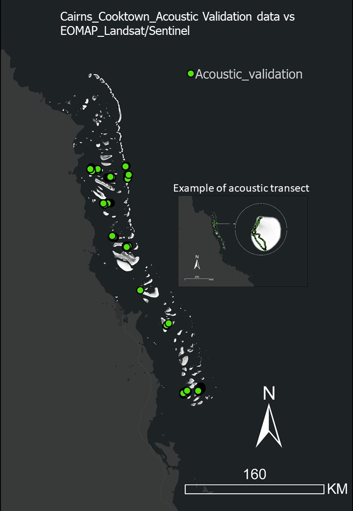

```{r loading packages, include=FALSE}

library(dplyr)
library(mgcv)
library(ggplot2)
library(MuMIn)
library(Cairo)
library(gridExtra)
library(tidyverse)

```

```{r setup, include=FALSE}
knitr::opts_chunk$set(echo = TRUE)
```

# Validation of EOMAP layers (depth derived from Landsat and Sentinel) vs acoustic validation data for Cairns-Cooktown region of the GBR


This document shows linear regressions between EOMAP depth layer derived from Landsat (EOMAP_Landsat) vs acoustic validation data and EOMAP depth layer derived from Sentinel (EOMAP_Sentinel) vs acoustic validation data. The figure below shows the location of acoustic validation data.





Fig. 1. Location of acoustic data collected in Cairns-Cooktown (GBR)


```{r, echo=FALSE}

## bring data
EOMAP_data <- read.csv("Z:/Australia/GBR/cairns_cook/Processing/depth_profiles/GBR_bathyfield/cc_Bathy_EOMAPSent/Acoustic_validation_L8vsSent.csv", header=T, stringsAsFactors=F)
##str(EOMAP_data) ##data type  
## isolating data for regress, getting the right columns
dataPrep <- select(EOMAP_data, Depth,SDB_10m, SDB_15m) ## select create a new dataframe with the columns of interest
##head(dataPrep)
RegressionDataset <- dataPrep %>% 
  mutate_if(is.numeric, round, 2) 
## getting rid of the -9999.000
EOMAP_clean <- filter(RegressionDataset, Depth != 0, SDB_10m != -9999.00, SDB_15m != -9999.00)
## change sign in depth readings
EOMAP_to_regress <- mutate(EOMAP_clean, Depth =Depth*(-1))
##head(EOMAP_to_regress)
## getting variables for regression (all data)
Acoustic_depth <- EOMAP_to_regress$Depth
EOMAP_Landsat_Depth <- EOMAP_to_regress$SDB_15m
EOMAP_Sentinel_Depth <- EOMAP_to_regress$SDB_10m

## getting variables for regression (0-5)

split0_5 <- filter(EOMAP_to_regress, Depth > -5, SDB_15m > -5, SDB_10m > -5 )  
Acoustic_depth_0_5m<-split0_5$Depth
EOMAP_Landsat_Depth_0_5m <- split0_5$SDB_15m
EOMAP_Sentinel_Depth_0_5m <- split0_5$SDB_10m

## getting variables for regression (0-10)
split0_10 <- filter(EOMAP_to_regress, Depth > -10, SDB_15m > -10, SDB_10m > -10 )  
Acoustic_depth_0_10m<-split0_10$Depth
EOMAP_Landsat_Depth_0_10m <- split0_10$SDB_15m
EOMAP_Sentinel_Depth_0_10m <- split0_10$SDB_10m

## getting variables for regression (0-15)
split0_15 <- filter(EOMAP_to_regress, Depth > -15, SDB_15m > -15, SDB_10m > -15 )  
Acoustic_depth_0_15m<-split0_15$Depth
EOMAP_Landsat_Depth_0_15m <- split0_15$SDB_15m
EOMAP_Sentinel_Depth_0_15m <- split0_15$SDB_10m


## linear model fitting (all data)

fit <- lm(EOMAP_Landsat_Depth ~ Acoustic_depth)
fit2 <-lm(EOMAP_Sentinel_Depth ~ Acoustic_depth)

## linear model fitting 0-5

fit3 <-lm(EOMAP_Landsat_Depth_0_5m ~ Acoustic_depth_0_5m)
fit4 <-lm(EOMAP_Sentinel_Depth_0_5m ~ Acoustic_depth_0_5m)

## linera fitting 0-10
fit5 <-lm(EOMAP_Landsat_Depth_0_10m ~ Acoustic_depth_0_10m)
fit6 <-lm(EOMAP_Sentinel_Depth_0_10m ~ Acoustic_depth_0_10m)

## linera fitting 0-15
fit7 <-lm(EOMAP_Landsat_Depth_0_15m ~ Acoustic_depth_0_15m)
fit8 <-lm(EOMAP_Sentinel_Depth_0_15m ~ Acoustic_depth_0_15m)

## these lines are to produce the plots individually not combine in the function below
##R2Plot<-ggplot(EOMAP_to_regress,aes(x=Acoustic.readings,y=EOMAP.Landsat.Depth))+geom_point()+scale_y_reverse()+scale_x_reverse()+geom_line(data=fortify(fit), color='Red', aes(x =Acoustic.readings, y = .fitted))

##R2Plot<-ggplot(EOMAP_to_regress,aes(x=Acoustic.readings,y=EOMAP.Landsat.Depth))+geom_point()+scale_y_reverse()+scale_x_reverse()+stat_smooth(method = "lm", col = "red")
  
##R2Plot

##geom_smooth(method = "lm", se=TRUE)


## function to get the regression annotation over the plot

ggplotRegression <- function (fit) { 
require(ggplot2)
ggplot(fit$model, aes_string(x = names(fit$model)[2], y = names(fit$model)[1])) + 
  geom_point() +
  stat_smooth(method = "lm", col = "red") +
  labs(title = paste("r2 = ",signif(summary(fit)$adj.r.squared, 5),
                     "Intercept =",signif(fit$coef[[1]],5 ),
                     " Slope =",signif(fit$coef[[2]], 5)))

                     #" P =",signif(summary(fit)$coef[2,4], 5))) # this is the P value

}

```

- **EOMAP Landsat depth vs Acoustic data (all data)**

```{r, echo = FALSE}
ggplotRegression(fit)

```

- **EOMAP Sentinel depth vs Acoustic data (all data)**

```{r, echo = FALSE}
ggplotRegression(fit2)

```

- **EOMAP Landsat depth vs Acoustic data (0-5 meter subset)**

```{r, echo = FALSE}
ggplotRegression(fit3)

```

- **EOMAP Sentinel depth vs Acoustic data (0-5 meter subset)**

```{r, echo=FALSE}
ggplotRegression(fit4)

```

- **EOMAP Landsat depth vs Acoustic data (0-10 meter subset)**

```{r, echo = FALSE}
ggplotRegression(fit5)

```

- **EOMAP Sentinel depth vs Acoustic data (0-10 meter subset)**

```{r, echo=FALSE}
ggplotRegression(fit6)

```

- **EOMAP Landsat depth vs Acoustic data (0-15 meter subset)**

```{r, echo = FALSE}
ggplotRegression(fit7)

```

- **EOMAP Sentinel depth vs Acoustic data (0-15 meter subset)**

```{r, echo=FALSE}
ggplotRegression(fit8)

```


